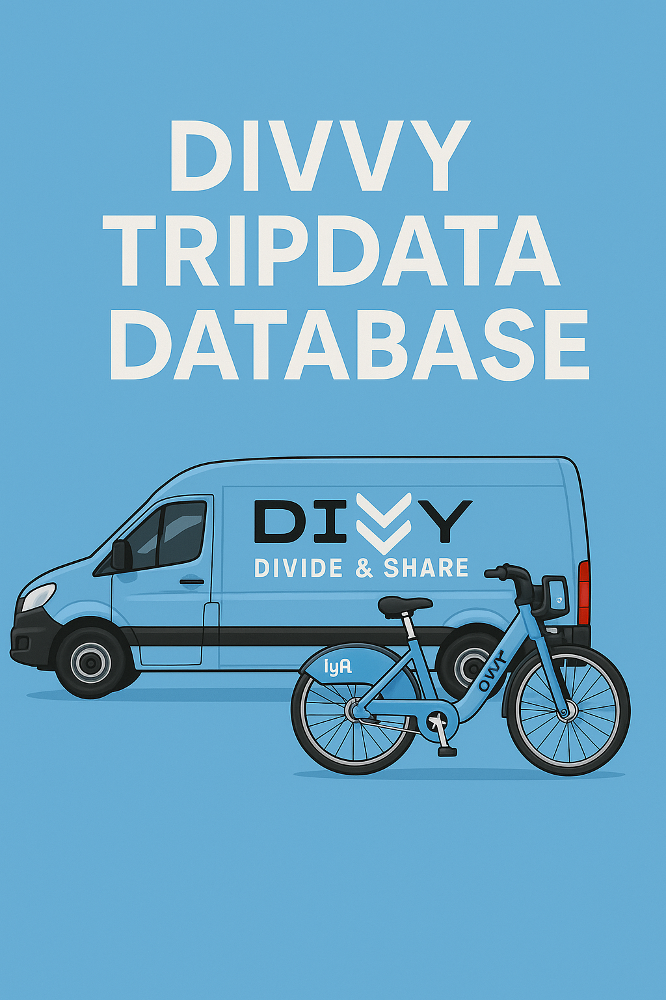

# Divvy Tripdata Database (2024)
### End-to-End Data Engineering & Analytics Project (6.5M+ Records)

---

## Project Summary

Designed and implemented a **production-style PostgreSQL analytical database** to transform 12 months of raw Divvy Bike Share trip data into a scalable, query-optimized environment.

The system consolidates **~6.5 million trip records** and enables fast behavioral, temporal, and spatial analysis of rider segments (**members vs casual users**).

This project demonstrates:

- Data modeling & normalization (3NF + star schema)
- Large-scale SQL optimization (indexes + materialized views)
- Automated ETL pipelines in R
- Analytical querying for business decision-making
- Database performance tuning

---

## Business Objective

Divvy generates millions of trip records annually. Without structure and optimization, extracting meaningful insights is slow and inconsistent.

This project answers:

- How do **member vs casual riders** differ in frequency and duration?
- What **stations and routes** drive the highest demand?
- Which **daily, weekly, and seasonal patterns** impact ridership?
- How can data improve **fleet balancing and marketing strategy**?

---

## Architecture & Design

### Database Design

Implemented a **star schema within a dedicated `divvy` schema**.

**Dimension Tables**
- `dim_station`
- `dim_bike_type`
- `dim_member_type`
- `dim_date`

**Fact Table**
- `fact_trips` (6.5M+ rows)
  - Foreign key relationships
  - Computed `ride_length_min`
  - Duration validation constraints

✔ 3NF normalization  
✔ Referential integrity  
✔ Data validation constraints  

---

## ETL & Automation

Built dynamic ETL workflows in R using:

- `DBI`
- `RPostgres`
- `readr`
- `glue`

Pipeline Process:

1. Load monthly CSV → staging tables  
2. Upsert dimension tables  
3. Insert into fact table  
4. Refresh materialized summaries  

The pipeline supports **future monthly append operations with minimal maintenance**.

---

## Performance Optimization

To support high-volume analytical queries:

### Index Strategy

- Time-based indexes (`started_at`, `started_date`)
- Segmentation indexes (`member_type_id`)
- Spatial indexes (`start_station_id`, `end_station_id`)
- Composite indexes (route pairs, date-member combinations)

### Materialized Views

- `mv_monthly_summary` — pre-aggregated monthly KPIs

Result: **Significant reduction in query latency for time-series and segmentation analysis.**

---

## Key Analytical Results

| Metric | Insight |
|--------|--------|
| Total rides analyzed | ~6.5 million |
| Avg ride duration (members) | 10–12 minutes |
| Avg ride duration (casual) | 30–40 minutes |
| Peak member activity | Weekday commute hours |
| Peak casual activity | Weekends & summer |
| Duration distribution | Right-skewed (<30 mins majority) |
| Spatial hotspots | Downtown & waterfront corridors |

---

## Business Impact

### Behavioral Insights
- Members exhibit consistent weekday commuting behavior.
- Casual riders drive seasonal and weekend demand spikes.

### Operational Insights
- High-volume waterfront stations suggest tourism-driven usage.
- Indexed architecture enables real-time KPI monitoring.
- Segmentation supports targeted promotions and resource allocation.

---

## Skills Demonstrated

**Data Engineering**
- Schema design (3NF + dimensional modeling)
- Fact/dimension architecture
- ETL automation
- Index optimization

**SQL & Performance**
- Complex joins across 6M+ rows
- View creation
- Materialized view optimization
- Query performance tuning

**Analytics**
- Time-series aggregation
- Behavioral segmentation
- Spatial demand analysis
- Distribution analysis

---

## Tech Stack

- PostgreSQL
- R
- SQL
- DBI / RPostgres
- ggplot2
- Glue

---

## Why This Project Matters

This project reflects how raw transactional data can be transformed into a **scalable analytical system** that supports:

- Millions of rows
- Fast KPI reporting
- Business strategy development
- Future predictive modeling extensions

It bridges **data engineering, analytics, and business decision support** in one cohesive system.

---

## Author

**Seif H. Kungulio**  
M.S. Data Analytics  
Machine Learning Certificate  